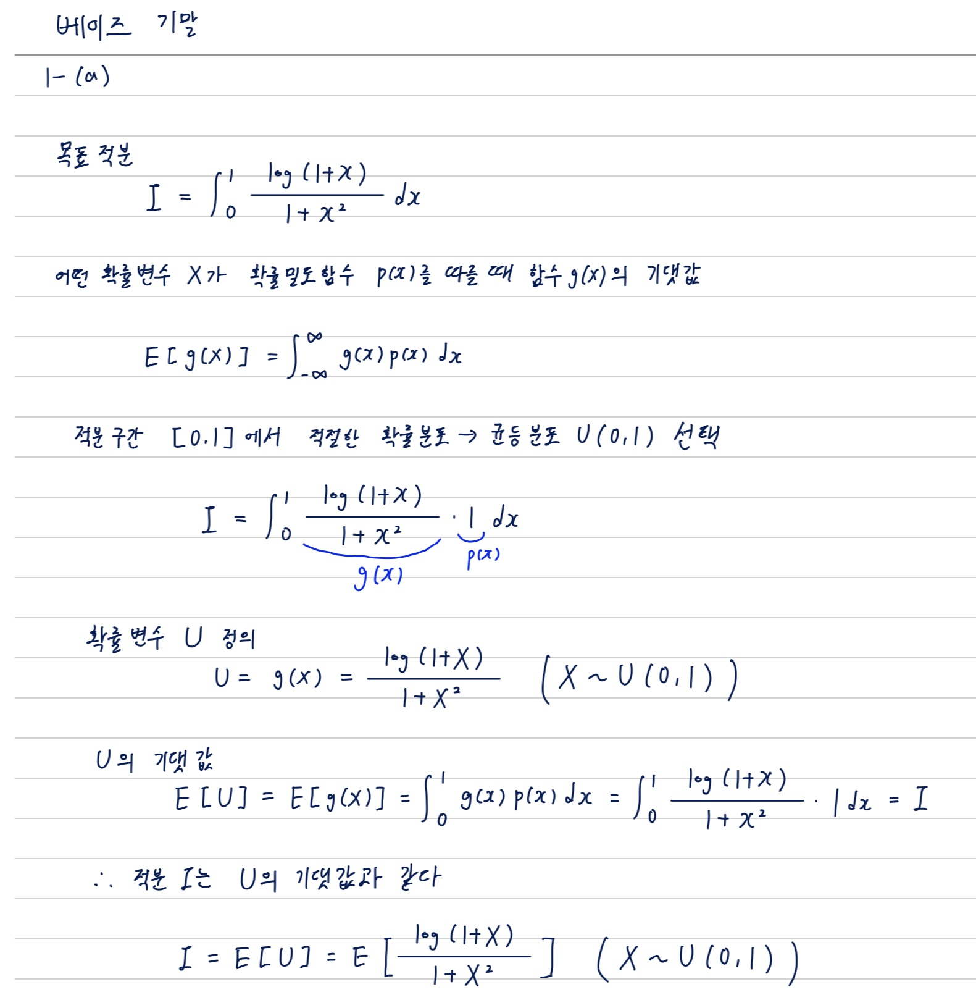
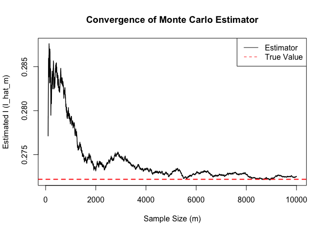
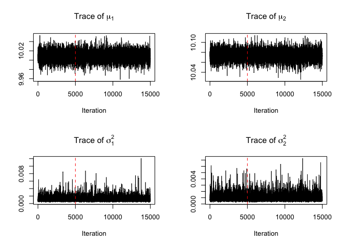
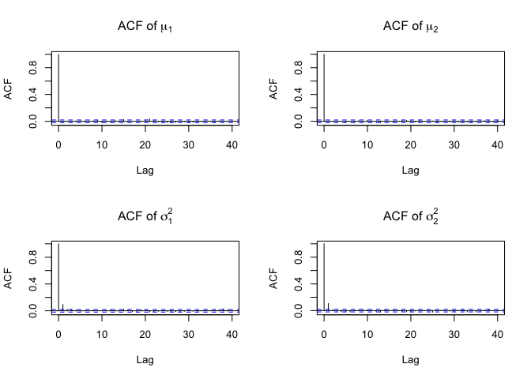
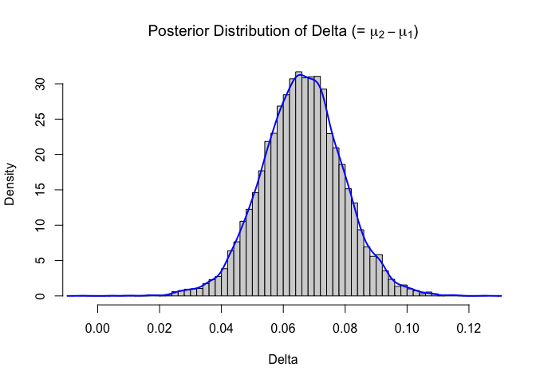
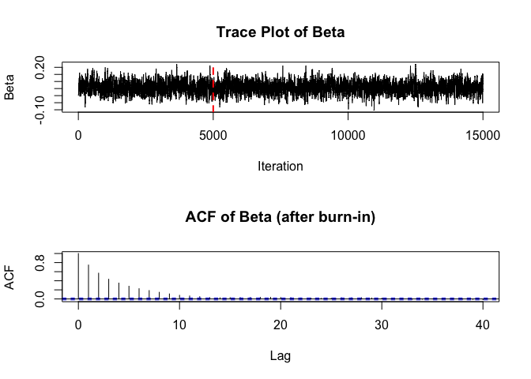
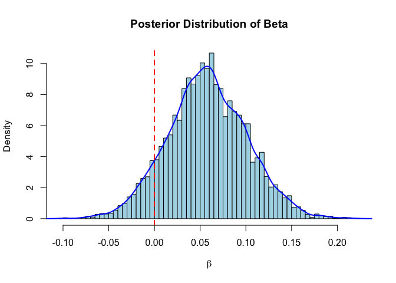

기말과제_베이즈 데이터 분석
================
2025-11-29

------------------------------------------------------------------------

# 문제 1

### (a)

<div class="figure" style="text-align: center">


<p class="caption">

1-(a) 수기문풀
</p>

</div>

### (b)

``` r
# 함수 정의
g <- function(x) {
  return(log(1 + x) / (1 + x^2))
}

set.seed(2025)    # 시드 설정

# 표본크기 m=5000
m <- 5000
u <- runif(m)     # 균등분포 U(0,1)에서 표본 생성
g_vals <- g(u)    # 각 표본에서 함수값 계산

I_hat <- mean(g_vals)     # 몬테카를로 추정치
s_gvals <- sd(g_vals)     # 표본 표준편차
se <- s_gvals / sqrt(m)   # 표준오차

# 95% 신뢰구간
ci_lower <- I_hat - (1.96 * se)
ci_upper <- I_hat + (1.96 * se)

cat("몬테카를로 추정치 (I_hat):", I_hat, "\n")
```

    ## 몬테카를로 추정치 (I_hat): 0.2715491

``` r
cat("95% 신뢰구간(CI): [", ci_lower, ", ", ci_upper, "]")
```

    ## 95% 신뢰구간(CI): [ 0.268679 ,  0.2744192 ]

### (c)

``` r
m_max <- 10000
u_max <- runif(m_max)
g_vals_max <- g(u_max)

# m = 1 ~ m_max까지의 누적 평균
I_hat_cum <- cumsum(g_vals_max) / (1:m_max)

# 그래프
m_range <- 100:m_max
I_hat_vals <- I_hat_cum[m_range]

plot(m_range, I_hat_vals, 
     type = 'l', 
     lwd = 1.5,
     main = "Convergence of Monte Carlo Estimator",
     xlab = "Sample Size (m)", 
     ylab = "Estimated I (I_hat_m)")

# 빨간색 점선: 해당 적분의 실제 값 (I = pi/8 * log(2))
true_I <- (pi/8)*log(2)
abline(h = true_I, col = 'red', lty = 2, lwd = 2)

# 범례
legend("topright", 
       legend=c("Estimator", "True Value"), 
       col=c("black", "red"), 
       lty=c(1, 2))
```

<!-- -->

그래프를 보면, 표본 크기 m이 작을 때는 파란색 선(추정치 I)이 위아래로
크게 흔들리지만, m이 커질수록 변동성이 줄어들면서 빨간색 점선(실제 값
I)에 수렴해가는 것을 확인할 수 있다. 대수의 법칙이 작동하고 있음을
의미한다.

# 문제 2

### (a)

사후표본은 총 15,000개(번인 5,000 포함) 추출하였으며, 분석은 번인 제거
후 10,000개 표본으로 수행하였다.

``` r
x_data <- c(10.02, 9.98, 10.01, 10.05, 9.99, 10.03, 10.00, 10.06, 9.97, 10.02, 10.01, 9.96)
y_data <- c(10.08, 10.04, 10.09, 10.11, 10.06, 10.07, 10.03, 10.10, 10.05, 10.12, 10.06, 10.09)

# 초기값
set.seed(2025)
n <- length(x_data)
m <- length(y_data)
x_bar <- mean(x_data)
y_bar <- mean(y_data)

mu_0 <- 10
s0_sq <- 0.01

# MCMC
N_total <- 15000
burn_in <- 5000

# 샘플 저장공간
mu1_post <- numeric(N_total)
s1_sq_post <- numeric(N_total)
mu2_post <- numeric(N_total)
s2_sq_post <- numeric(N_total)

# MCMC 초기값
mu1_post[1] <- x_bar
s1_sq_post[1] <- var(x_data)
mu2_post[1] <- y_bar
s2_sq_post[1] <- var(y_data)

# 깁스 샘플링
for (i in 2:N_total) {
  
  # 공장 1
  # mu_1 샘플링 (이전 단계의 s1_sq_post[i-1] 사용)
  tau2_n1 <- 1 / (n / s1_sq_post[i-1] + 1 / s0_sq)
  mu_n1 <- tau2_n1 * (n * x_bar / s1_sq_post[i-1] + mu_0 / s0_sq)
  mu1_post[i] <- rnorm(1, mean = mu_n1, sd = sqrt(tau2_n1))
  
  # s1_sq 샘플링 (방금 샘플링한 mu1_post[i] 사용)
  ss1 <- sum((x_data - mu1_post[i])^2)
  # 역감마에서 샘플링: 1 / Gamma(n/2, rate = ss1/2)
  s1_sq_post[i] <- 1 / rgamma(1, shape = n/2, rate = ss1/2)
  
  # 공장 2
  # mu_2 샘플링
  tau2_n2 <- 1 / (m / s2_sq_post[i-1] + 1 / s0_sq)
  mu_n2 <- tau2_n2 * (m * y_bar / s2_sq_post[i-1] + mu_0 / s0_sq)
  mu2_post[i] <- rnorm(1, mean = mu_n2, sd = sqrt(tau2_n2))
  
  # s2_sq 샘플링
  ss2 <- sum((y_data - mu2_post[i])^2)
  # 역감마
  s2_sq_post[i] <- 1 / rgamma(1, shape = m/2, rate = ss2/2)

}

# 15,000개의 사후표본
mu1_15000     <- mu1_post
s1_sq_15000 <- s1_sq_post
mu2_15000     <- mu2_post
s2_sq_15000 <- s2_sq_post

# Burn-in 기간(5000개) 제거 후 최종 사후표본 추출
mu1_final <- mu1_post[(burn_in + 1):N_total]
s1_sq_final <- s1_sq_post[(burn_in + 1):N_total]
mu2_final <- mu2_post[(burn_in + 1):N_total]
s2_sq_final <- s2_sq_post[(burn_in + 1):N_total]

# 관심 모수 delta의 사후표본 계산
delta <- mu2_final - mu1_final

cat("총 15,000번 실행 중 10,000개의 사후표본을 확보함.\n\n")
```

    ## 총 15,000번 실행 중 10,000개의 사후표본을 확보함.

### (b)

``` r
# 1. 시계열 그림 (Burn-in 기간 포함)
par(mfrow = c(2, 2)) # 2x2 그리드

plot(mu1_post, type = 'l', main = expression(paste("Trace of ", mu[1])), 
     xlab = "Iteration", ylab = "")
abline(v = burn_in, col = "red", lty = 2) # Burn-in 지점 표시

plot(mu2_post, type = 'l', main = expression(paste("Trace of ", mu[2])), 
     xlab = "Iteration", ylab = "")
abline(v = burn_in, col = "red", lty = 2)

plot(s1_sq_post, type = 'l', main = expression(paste("Trace of ", sigma[1]^2)), 
     xlab = "Iteration", ylab = "")
abline(v = burn_in, col = "red", lty = 2)

plot(s2_sq_post, type = 'l', main = expression(paste("Trace of ", sigma[2]^2)), 
     xlab = "Iteration", ylab = "")
abline(v = burn_in, col = "red", lty = 2)
```

<!-- -->

``` r
par(mfrow = c(1, 1)) # 플롯 설정 초기화

# 2. ACF 그림 (Burn-in 기간 제외)
par(mfrow = c(2, 2))

acf(mu1_final, main = expression(paste("ACF of ", mu[1])))
acf(mu2_final, main = expression(paste("ACF of ", mu[2])))
acf(s1_sq_final, main = expression(paste("ACF of ", sigma[1]^2)))
acf(s2_sq_final, main = expression(paste("ACF of ", sigma[2]^2)))
```

<!-- -->

``` r
par(mfrow = c(1L, 1L))
```

4개의 시계열 그림 모두에서, 빨간 점선(번인) 이후 특정한 추세 없이 일정한
평균을 중심으로 빽빽하고 고르게 분포하는 모습을 볼 수 있다. 이것은 깁스
샘플러가 초기값의 영향에서 완전히 벗어나 정상 분포에 도달하였고, 표본
공간을 안정적으로 탐색하고 있음을 의미한다.  
4가지 모수 모두 시차(lag)가 조금만 증가해도 자기상관계수가 급격히 0으로
떨어지는 모습을 볼 수 있다. 자기상관이 빠르게 소멸한다는 것은 추출된
사후 표본들 간의 독립성이 매우 높고, 깁스 샘플러가 표본 공간을
효율적으로 탐색하고 있음을 의미한다.  
따라서 깁스 샘플링을 통해 생성된 마코프 체인은 목표 사후분포에
성공적으로 수렴하였다고 볼 수 있다. 추가적인 표본 크기 확대는 필요하지
않다. <br>

### (c)

``` r
# 히스토그램
hist(delta, breaks = 50, freq = FALSE,
     main = expression(paste("Posterior Distribution of Delta (= ", mu[2] - mu[1],")")),
     xlab = "Delta",
     ylab = "Density")

# 사후분포의 밀도 추정 곡선 추가
lines(density(delta), col = "blue", lwd = 2)
```

<!-- -->

이 분포는 대부분 0보다 큰 값에 치우쳐 있으며, 정규분포와 유사한 종
모양이다. δ의 사후분포의 평균은 0보다 큰 양수 값(약 0.06)에 위치하고
있다. 이것은 공장 2의 부품 길이가 공장 1 부품보다 유의미하게 길 확률이
아주 높다는 것을 의미한다.

### (d), (e)

``` r
# (d) 통계량
mean_d <- mean(delta)
sd_d <- sd(delta)
ci_d <- quantile(delta, c(0.025, 0.975))

cat("사후평균:", round(mean_d,5), "\n")
```

    ## 사후평균: 0.0661

``` r
cat("사후표준편차:", round(sd_d,5), "\n")
```

    ## 사후표준편차: 0.01307

``` r
cat("95% 신용구간:", "[", round(ci_d[1], 5), ",", round(ci_d[2], 5), "]", "\n\n")
```

    ## 95% 신용구간: [ 0.04087 , 0.09181 ]

``` r
# (e) 사후확률 P(delta > 0 | data)
prob_pos <- mean(delta > 0)
cat("P(delta > 0 | data):", prob_pos, "\n")
```

    ## P(delta > 0 | data): 0.9999

사후확률을 보면, 공장 2의 평균 길이가 공장 1의 평균 길이보다 유의미하게
길 확률이 거의 100%에 가깝다고 할 수 있다.

------------------------------------------------------------------------

# 문제 3

### (a)

**-주어진 포아송 회귀모형**
$$\log(\lambda_i) = \log(E_i) + \alpha + \beta(t - 6.5)$$

**-양변에 지수($\exp$)를 취하여 정리**
$$\lambda_i = E_i \cdot \exp(\alpha + \beta(t - 6.5))$$  
$$\frac{\lambda_i}{E_i} = \exp(\alpha + \beta(t - 6.5))$$

**-변수의 의미**  
\* $\lambda_i$: $i$번째 달의 기대 사망자 수 \* $E_i$: $i$번째 달의 월별
차량 통행량 (단위: 백만 대)

<br>

**1. $\exp(\alpha + \beta(t-6.5))$의 의미**

좌변 $\frac{\lambda_i}{E_i}$는 (기대 사망자 수) / (차량 통행량)으로,
’차량 통행량(백만 대) 당 기대 사망자 수’를 의미한다. 즉,
$\exp(\alpha + \beta(t-6.5))$는 **$t$ 시점(월)의 사고 사망률(rate)**을
의미한다.

<br>

**2. $\beta$의 의미**

$\beta$는 시간($t$)에 대한 회귀 계수이다. $t$가 1단위(1개월) 증가할 때,
로그-사망률(log-rate)이 $\beta$만큼 변화함을 의미한다. 즉, **시간의
흐름에 따른 사망률의 증감 추세**를 나타낸다.

- **$\beta > 0$**: 시간이 지남에 따라 (통행량을 보정하고도) 사망률이
  **증가**
- **$\beta < 0$**: 시간이 지남에 따라 사망률이 **감소**
- **$\beta = 0$**: 시간의 흐름에 따른 사망률의 **변화(추세) 없음**

### (b)

``` r
y <- c(3, 1, 2, 4, 5, 6, 2, 3, 4, 7, 5, 4)
E <- c(8.1, 7.5, 7.9, 8.3, 8.7, 9.0, 8.4, 8.2, 8.6, 9.1, 8.9, 8.8)
t <- 1:12
t_centered <- t - 6.5

# 로그-사후분포 함수
log_posterior <- function(alpha, beta) {
  # 로그 가능도
  log_lambda <- log(E) + alpha + beta * t_centered
  lambda <- exp(log_lambda)
  ll <- sum(dpois(y, lambda, log=TRUE))
  
  # 로그 사전확률: alpha, beta ~ N(0, 10^2) -> sd=10
  l_prior <- dnorm(alpha, mean=0, sd=10, log=TRUE) + 
             dnorm(beta, mean=0, sd=10, log=TRUE)
  
  return(ll + l_prior)
}

# MCMC 실행 (M-H 알고리즘)
set.seed(2025)
N_total <- 15000
burn_in <- 5000

# 저장 공간
alpha_post <- numeric(N_total)
beta_post <- numeric(N_total)

# 초기값
alpha_post[1] <- 0
beta_post[1] <- 0

# 튜닝 파라미터
prop_sd_alpha <- 0.15 
prop_sd_beta <- 0.05 

# MCMC 루프
for (i in 2:N_total) {
  
  # Alpha 업데이트
  a_curr <- alpha_post[i-1]
  b_curr <- beta_post[i-1]
  a_prop <- rnorm(1, a_curr, prop_sd_alpha)
  
  # 수락 확률 계산
  log_r <- log_posterior(a_prop, b_curr) - log_posterior(a_curr, b_curr)
  if (log(runif(1)) < log_r) {
    alpha_post[i] <- a_prop # 수락
  } else {
    alpha_post[i] <- a_curr # 기각
  }
  
  # Beta 업데이트
  a_new <- alpha_post[i]
  b_curr <- beta_post[i-1]
  b_prop <- rnorm(1, b_curr, prop_sd_beta)
  
  # 수락 확률 계산
  log_r <- log_posterior(a_new, b_prop) - log_posterior(a_new, b_curr)
  if (log(runif(1)) < log_r) {
    beta_post[i] <- b_prop # 수락
  } else {
    beta_post[i] <- b_curr # 기각
  }
}

# 15000개 표본
alpha_15000 <- alpha_post
beta_15000 <- beta_post

# Burn-in 제거 후 최종 사후표본 추출
alpha_final <- alpha_post[(burn_in + 1):N_total]
beta_final <- beta_post[(burn_in + 1):N_total]

cat("총 15,000번 실행 중 10,000개의 사후표본을 확보함.\n\n")
```

    ## 총 15,000번 실행 중 10,000개의 사후표본을 확보함.

### (c)

``` r
par(mfrow=c(2,1)) # 화면 분할

# 시계열 그림
plot(beta_post, type='l', main="Trace Plot of Beta", 
     ylab="Beta", xlab="Iteration")
abline(v=burn_in, col="red", lty=2, lwd=2) # burn_in 라인

# ACF 그림
acf(beta_final, main="ACF of Beta (after burn-in)", lag.max=40)
```

<!-- -->

``` r
par(mfrow=c(1,1)) # 화면 분할 초기화
```

시계열 그림을 보면 빨간 선(번인) 이후 특정한 추세 없이 안정적으로
분포하고 있다. 체인이 자주 위아래로 움직이며 공간도 잘 탐색하고
있다(mixing). 이것은 마코프 체인이 초기값의 영향에서 벗어나 목표
사후분포에 성공적으로 수렴했음을 보여준다.  
ACF 그림을 보면 시차(lag)가 증가함에 따라 자기상관계수가 점차 0으로
수렴하는 것을 알 수 있다. 파란 점선(유의경계)을 대부분의 시차(lag)에서
넘지 않거나 살짝 넘었다가 금방 떨어지는 모습을 보면 자기상관은 있으나
길게 끌지는 않는다. 따라서 표본 크기는 사후분포를 추론하기에
충분할정도로 유효한 표본크기라고 할 수 있다.

### (d)

``` r
# 히스토그램
hist(beta_final, breaks=50, prob=TRUE, 
     main="Posterior Distribution of Beta", 
     xlab=expression(beta), col="lightblue")
lines(density(beta_final), col="blue", lwd=2)
abline(v=0, col="red", lty=2, lwd=2) # 0 기준선
```

<!-- --> $\beta$의 사후분포
히스토그램은 대칭적인 종 모양(Bell-shape)으로 정규분포와 유사한
형태이다. 이것은 표본의 크기가 충분하여 사후분포가 잘 형성되었다는 것을
의미한다.  
그림의 붉은색 수직선($\beta$=0)을 기준으로 볼 때, 사후분포의
중심(Mode)과 대부분의 질량이 0보다 큰 양수 영역(오른쪽)에 위치하고 있다.
이것은 시간이 지남에 따라 사고율이 증가하는 경향(β\>0)이 강하게 있음을
보여준다. 다만, 분포의 일부(왼쪽 꼬리)가 0보다 작은 음수 영역에 걸쳐
있어, 사고율의 감소 가능성을 완전히 배제할 수는 없다.

### (e), (f)

``` r
# (e) 통계량
mean_beta <- mean(beta_final)
sd_beta <- sd(beta_final)
ci_beta <- quantile(beta_final, c(0.025, 0.975))

cat("사후 평균:", round(mean_beta, 5), "\n")
```

    ## 사후 평균: 0.05773

``` r
cat("사후 표준편차:", round(sd_beta, 5), "\n")
```

    ## 사후 표준편차: 0.04333

``` r
cat("95% 신용구간:", "[", round(ci_beta[1], 5), ",", round(ci_beta[2], 5), "]", "\n\n")
```

    ## 95% 신용구간: [ -0.02615 , 0.14426 ]

``` r
# (f) 사후확률 P(beta > 0 | data)
prob_beta_pos <- mean(beta_final > 0)

cat("P(beta > 0 | data):", prob_beta_pos, "\n")
```

    ## P(beta > 0 | data): 0.9083

사후확률을 보면 데이터가 주어졌을 때 ($\beta$ \> 0)일 확률, 즉 시간이
지남에 따라 사고율이 증가하고 있을 확률은 약 90.8%이다. 이것은 통계적
유의성 기준인 95%에는 미치지 못하지만, 90% 이상이라는 점에서 사고율의
증가 추세가 유의미하고 강력하다는 것을 의미한다.
